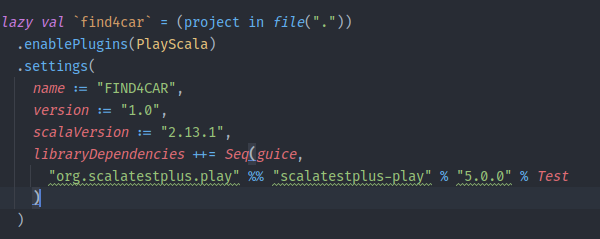

# Ejercicio 1

En mi caso he usado como ejemplo sbt para manejar las diferentes versiones de scala. En sbt es tan sencillo como especificar en el fichero de configuración build.sbt la versión de scala que queremos usar con el key *scalaVersion*. Por ejemplo: `scalaVersion := "2.13.1"`

# Ejercicio 2

# Ejercicio 3

Como mi proyecto está hecho en scala no me he parado a probar el del ejemplo. Lo que si he usado otro framework diferente como es Play2 framework para crear mi aplicación.